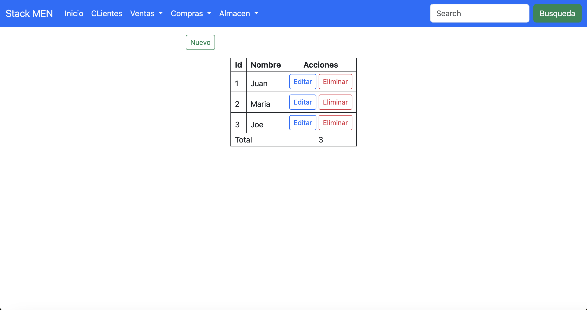

# STACK MEN

## Vista Previa



## Instalación

Siga estos pasos para instalar el proyecto en su máquina local.x

1. Clona este repositorio en tu máquina local usando Git:
   ```bash
   git clone git@github.com:DuberlyIvanMondragonManchay/STACK_MEN.git
2. Navega a la carpeta de tu proyecto:

   ```bash 
   cd STACK_MEN
3. Instala las dependencias del proyecto usando npm:
   ```bash
   npm i
   ```
4. Crea las tablas usando prisma:
   ```bash
   npx prisma migrate dev
5. Ejectuta el proyecto con npm run dev
   ```bash 
    npm run dev
   ```
6. Visita la ruta http://localhost:3000